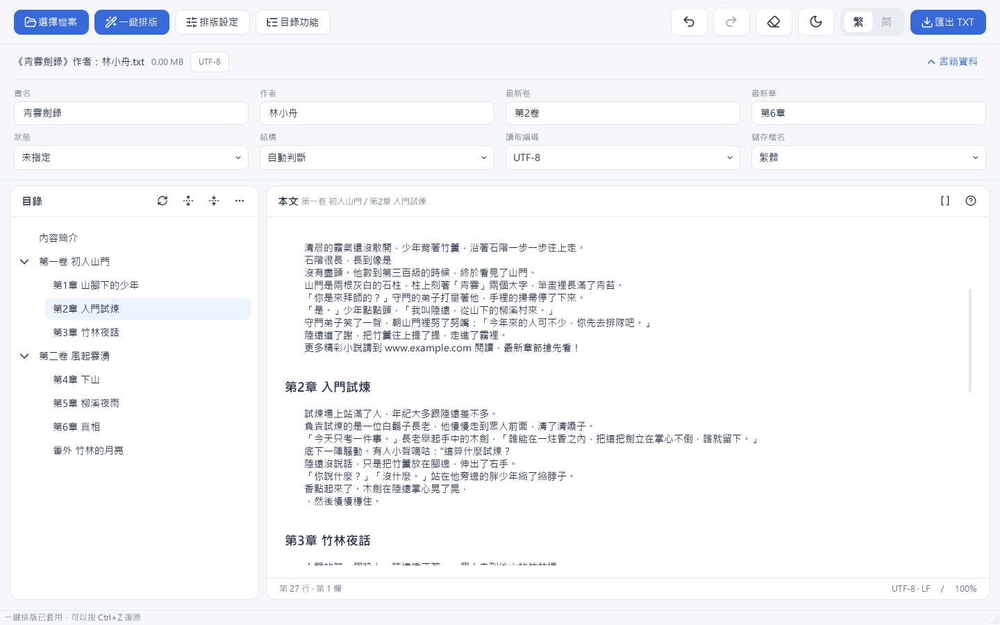
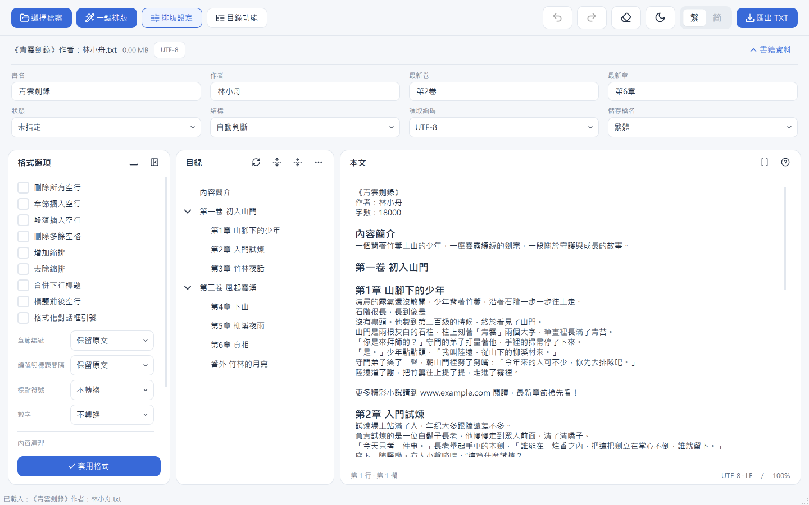
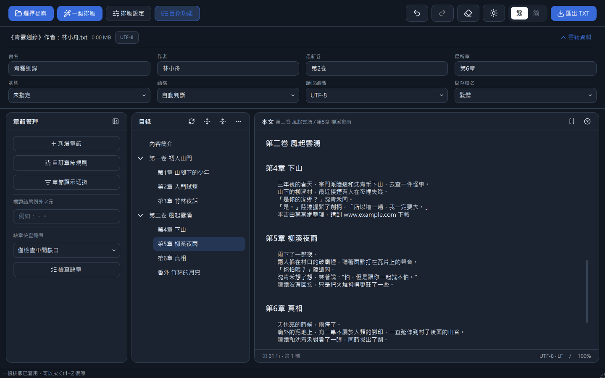
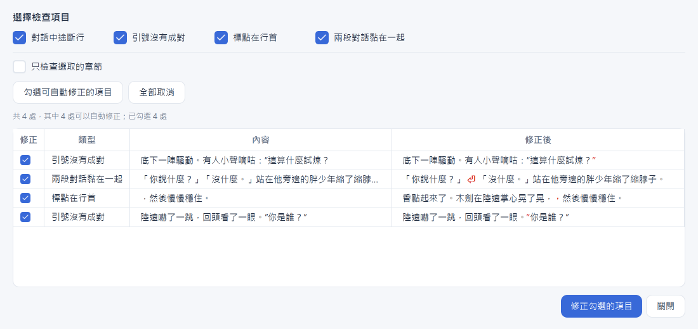

# TXT 排版工具

智慧辨識章節、整理純文字小說的排版工具（PySide6 介面）。純邏輯（章節辨識、
廣告掃描、換行整理…）放在 `core/`，介面放在 `ui_qt/`。

## 下載

到 [Releases](../../releases) 下載 `txt-tool.exe`（頁面上顯示為「TXT排版工具.exe」），雙擊就能執行，不需要安裝 Python。
（沒有數位簽章，第一次開啟時 Windows 可能顯示「已保護您的電腦」，按「其他資訊」→「仍要執行」。）

設定存放在 `%LOCALAPPDATA%\TXTFormatterV3`：自訂章節規則（`chapter_rules.json`）、
排版設定與選單狀態（`ui_state.json`）、視窗大小（`window.json`）、執行記錄（`logs/`）。
換新版 exe 或搬動 exe 位置，設定都會保留；原始碼版與 exe 版共用同一份。

## 功能

> 截圖中的小說《青雲劍錄》是示範用的自編內容。

### 自動辨識章節、一鍵排版



- 開檔自動偵測編碼（UTF-8、Big5、GB18030…），從檔名取出書名與作者。
- 自動辨識卷、章、番外、序章等標題，建立可摺疊的目錄；點目錄直接跳到那一章，
  本文上方顯示目前所在的卷／章。
- 「一鍵排版」套用常用組合：刪除多餘空行、段首縮排、章節前後空行、標題編號與章名之間的間隔。
- 「書籍資料」自動填入最新卷／章與連載狀態，匯出時組成檔名，
  例如「《青雲劍錄》【更新至第2卷第6章+番外】作者：林小舟.txt」、完結時「《書名》（完結）作者：某某.txt」。
- 所有修改都可以 Ctrl+Z 復原。

### 排版設定



- 逐項勾選：刪除空行、段落插入空行、刪除多餘空格、增加／去除縮排、合併下行標題、
  標題前後空行、對話框引號格式化。
- 章節編號改成中文數字或阿拉伯數字、編號與標題的間隔（半形／全形空格、冒號）、
  標點符號與數字轉全形或半形。
- 內容清理工具：掃描廣告、引號與標點檢查、繁簡轉換（全文或只轉選取的章節）。

### 目錄功能與深色模式



- 新增章節、自訂章節規則、切換完整標題／簡稱、缺章檢查（找出跳號的章節）。
- 目錄右鍵：剪下並貼到其他章節前後、合併章節、連續編號、設為卷／章標題、
  標註為非章節、整理換行與空白、只對這一章套用排版或繁簡轉換。
- 淺色／深色主題，介面可切換繁體或簡體中文。
- 尋找／取代（Ctrl+F），支援正則表達式。

### 引號與標點檢查



- 找出對話中途斷行、引號沒有成對、標點在行首、兩段對話黏在一起。
- 有明確正確寫法的可以一鍵修正，「修正後」欄用紅字標出會改動的字。
- 對話框開著時可以直接在本文手動修改；切回對話框會自動重新檢查。

### 掃描廣告


- 找出網址、下載頁、QQ／微信、小說來源、重複段落、作品資訊與分隔線。
- 依信心高低分級，高信心預設勾選；點一列跳到本文那一行確認後再刪除。

### 自訂章節規則


- 勾選常用格式（#1、1. 標題、一、標題、卷一、Chapter 1…）就能辨識非標準的章節寫法。
- 貼上一行章節標題就能自動產生規則，不必懂正則；也可以自己寫正則。
- 「本文可疑章節」列出看起來像標題、但還沒進目錄的行，勾選後一次加入。

## 從原始碼執行

```bash
python -m pip install PySide6
python -m ui_qt
```

選用套件：`opencc-python-reimplemented`（簡體介面、匯出檔名與正文的繁簡轉換）。

也可以執行單檔版：`python tools/build_single_file.py` 會產生
`dist/TXT排版工具_單檔版.py`，單一檔案就能執行。

打包成 exe（需要 `pip install pyinstaller`）：`python tools/build_exe.py` 會產生
`dist/TXT排版工具.exe`。

## 專案結構

```
core/       純邏輯，跟介面無關
  chapter_parse.py       單行章節標題辨識（預設只收正規格式）
  user_rules.py          自訂章節規則與常用格式
  collection.py          多作品合集、未辨識章節候選、缺章檢查
  structure_builder.py   整份文件的章節結構／目錄樹建立
  ad_scan.py             廣告與作品資訊掃描
  quote_check.py         引號與標點檢查
  reflow.py              硬換行／異常空白整理
  script_convert.py      繁簡轉換（OpenCC）
  persistence.py         自訂規則／視窗狀態存檔
  ...

ui_qt/      PySide6 介面
  main_window.py         主視窗
  *_dialog.py            各功能對話框
  find_bar.py            尋找／取代面板
  theme.py               色彩 token 與樣式表
  icons.py               內嵌 SVG 圖示
  app_log.py             記錄檔與卡死監看（Ctrl+Shift+L 開啟記錄檔資料夾）

tools/build_single_file.py   打包成單一 .py 檔
tools/build_exe.py           打包成單一 exe（PyInstaller）
test_*.py                    pytest 測試
```

## 測試

```bash
python -m pip install pytest
python -m pytest -q
```
